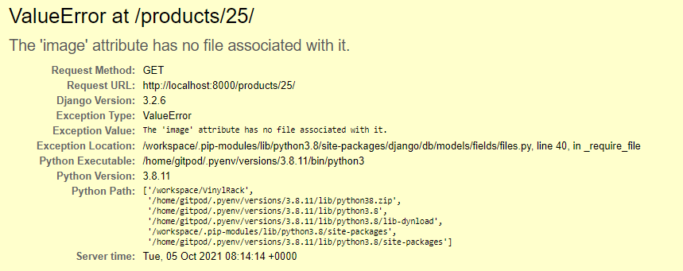

## Testing

### Table of Contents

[Test Strategy](#teststrategy)

[Responsive Testing](#responsivetesting)

[User Story Testing](#userstorytesting)

[Functional/Features Testing](#functionaltesting)

[Code Validation](#codevalidation)

[Bugs / Issues](#bugsissues)

## Test Strategy

To test responsiveness of the site [Chrome DevTools](https://developer.chrome.com/docs/devtools/) will be used. This ensures the site is usable on a varitey of different devices and screen sizes.

To ensure the site is fit for purpose all user stories and features documented in the main README.md file are to be tested. The test procedures
and results are documented below.

The code (HTML/CSS/JS/Python) must also satisfy the requirements of the online validation tools. These are:
* [W3C Markup Validation Service](https://validator.w3.org/). Check the markup of web documents.
* [W3C CSS Validator](https://jigsaw.w3.org/css-validator/). Check Cascading Style Sheets
* [JS Hint](https://jshint.com/). Javascript code quality tool. 
* [PEP8 Online](http://pep8online.com/). Checks Python code for PEP8 compliance.

Google Lighthouse will be used to check the Performance, Accessibility, Best Practices and Search Engine Optimisation of the website.

## Responsive Testing

### Mobile & Tablet
The responsiveness of the site was tested using the Device Mode in [Chrome DevTools](https://developer.chrome.com/docs/devtools/). For mobile devices the minimum screen width the site was tested at was 320 pixels (iPhone SE). The following mobile and tablet options were tested in [Chrome DevTools](https://developer.chrome.com/docs/devtools/):

* Moto G4, Galaxy S5, Pixel 2, Pixel 2 XL, iPhone 5/SE, iPhone 6/7/8, iPhone 6/7/8 Plus, iPhone X, iPad, iPad Pro, Surface Duo, Nest Hub & Nest Hub Max

The responsiveness was also tested on an actual Samsung Galaxy S8 Plus and an iPhone 12 ProMax. The site was consistently resposive across all devices and screen sizes with the layout responding as expected.

### Desktop
The resposiveness of the site on desktop devices was tested using Chrome, Firefox, Edge, Opera and Safari browsers. The site was tested using the following screen widths:

* 1024 pixels, 1280 pixels, 1440 pixels, 1600 pixels and 1920 pixels.

The site was consistently resposive across all devices and screen sizes with the layout responding as expected.

## User Story Testing

### New Users
* *"As a new user, I want a clear layout so I can easily navigate the site on all platforms."*
    * The website has been developed to work on different browsers accross all platforms. Extensive testing has been performed (see [Functional/Features Testing](#functionaltesting) below).
* *"As a new user, I would like view all records sold within the store without having to register for an account."*
    * User scan browse and purchase products without registering for an account.
* *"As a new user, I would like to see new releases and/or special offers on the Home page."*
    * The Home Page will displayed the last 8 products added to the store. A link to products on sale is jumbotron at the top of the page.
* *"As a new user, I would like see all releases within a particular genre."*
    * Users can browse by Genre by clicking on the 'By Genre' link in the Catalogue dropdown menu.
* *"As a new user, I would like to see all releases by a particular artist/band."*
    * Users can browse by Artist by clicking on the 'By Artist' link in the Catalogue dropdown menu.
* *"As a new user, I would like the ability to search the store either by artist or album name."*
    * Users can search the website using the search bar at the top of the screen. This searches artist names, album titles and album descriptions.
* *"As a new user, I would like to be able to add items to a shopping basket"*
    * When viewing the detail of any products users can add the item to their shopping bag. Items can also be added from a users wishlist.
* *"As a new user, I would like to be able to edit / delete items that are already in my shopping basket."*
    * Users can edit / delete items in their shopping back before completing the checkout process.
* *"As a new user, I would like to clearly see the total cost of my order including any shipping costs."*
    * Shipping costs are clearly shown on the shopping bag page.

### Registered Users
* *"As a registered user, I would like to see my previous orders or the status of current orders."*
    * Prvious orders can be viewed on the users profile page. This is accessed via the My Profile link in My Account dropdown menu.
* *"As a registered user, I would like to save items to a wish list so I can keep track of potential future purchases."*
    * Whistl browsing the site users can add any products to their wishlist. The wishlist can be viewed by clicking on the My Wishlist link in the My Account dropdown.
* *"As a registered user, I would like the option to save my delivery details so I don't need to keep enetering them."*
    * Default delivery information can be added to the users profile page. Delivery information can also be saved to a users profile during the checkout process by checking the 'Save this delivery information to my profile' checkbox on the checkout page.
* *"As a registered user, I would like the ability write a review of a record sold on the site."*
    * A user can leave a review for a product via any product details page. A users can leave a written review along with a star rating between 0 and 5. A list of user reviews can be found by clicking the My Reviews link in the My Account dropdown menu.
* *"As a registered user, I would like the ability to edit or delete a previous review that I have left for a particular product."*
    * Reviews can be editted/deleted via the My Reviews page by clicking the appropriate link next to the review.
* *"As a registered user, I would like the ability to edit or delete my profile/account."*
    * This feature has not been implemented. However, user profiles can be deleted by any site administrators via the Django control panel.

### Returning Users
* *"As a returning user, I would like to easily see what new records have been added to the site."*
    * The 'New In' page displays the 8 most recent records added to the store. This page is accessible via the navigation bar at the top of the screen on desktop devices and in the burger menu on mobile devices.
* *"As a returning user, I would like to follow the record store on social media so I can stay updated on any upcoming events or new releases."*
    * Social media links are listed in the footer - these are visible on all pages.
* *"As a returning user, I would like to have the ability to contact the store if I have any questions or queries regarding a product or order."*
    * A 'Contact Us' link is available in the site footer. This is visible on all pages. Clicking on the link opens a page displaying a form that the user can complete to send any questions or quiries to the site admin.

### Store Owner / Administrator
* *"As the store owner / admin, I would like the ability to add records to the website."*
    * Records can be added to the site via the Product Management page. Once the user is logged in and has the correct permissions the Product Management page can be accessed via the My Account icon in the navigation bar.
* *"As the store owner / admin, I would like the ability to edit records on the website."*
    * When logged in as an admin the edit option for a record will be visibe on the products page and the product details page. Clicking on this link will open the edit product page.
* *"As the store owner / admin, I would like the ability to delete records from the website."*
    * When logged in as an admin the delete option for a record will be visibe on the products page and the product details page. Clicking on this link will open a modal for the to confirm delete of the item from the database.
* *"As the store owner / admin, I would like the ability to apply discounts to indiviual records."*
    * The product model has a boolean field 'on_sale' and when this is True the item will be marked for sale on the site. The percentage discount is entered in the 'discount_percent' field. These fields can be set when adding a new product to the site or when editing an existing product.
* *"As the store owner / admin, I would like the ability to apply site wide discounts for large sale events."*
    * Currently the only way to apply discounts to products is using the 'on_sale' and 'discount_percent' fields as described above. There is no method of providing site wide discounts but this could be added at a future date.
* *"As the store owner / admin, I would like the ability to tag items to appear in the home page."*
    * Currently the home page displays the last 8 items added to the database. The only way for the admin to tag an item for displaying on the home page is to modify the date added field. This isn't ideal but was deemed a suitable solution for this implementation/release of the site.
* *"As the store owner / admin, I would like the ability to edit or delete any user reviews if they breach the website guidelines."*
    * Site administrators can edit or delete any reviews via the Django admin console. This feature wasn't implemented on the main site as the admin console provides all the functionality that is required.

## Functional/Features Testing

### Test-001 : Navigation Bar
Test navigation bar links function correctly and that the correct links are displayed for admin and non admin users.

1. Open Chrome browser and navigate to: https://vinyl-rack.herokuapp.com/. Logout of the site if logged in.
2. Check that the nav bar is fixed to the top of the browser window when scrolling down.
3. With the user logged out check that the following menu options appear in the the My Account drop down menu:
    * Register & Login
4. Click each of the menu options listed above and confirm that you are taken to the correct page.
5. Login as a regular non admin user and check that the following menu options appear in My Account drop down menu::
    * My Profile, My My Wishlist, My Reviews & Logout.
6. Click each of the menu options listed above and confirm that you are taken to the correct page. Clicking the Logout option should log you out of the website.
7. Login in using an administrator account and check that the following options appear in the nav bar:
    * Product Management, My Profile, My My Wishlist, My Reviews & Logout
8. Click each of the menu options listed above and confirm that you are taken to the correct page. Clicking the Logout option should log you out of the website.
9. On desktop devices confirm that clicking on the Vinyl Rack icon in the top left returns the user to the home page.
10. Confirm that all the navigation links under the Catalogue drop down menu function correclty. On mobile devices these will collapse into a hamburger icon.
11. Confirm that the New In and On Sale links function correclty. On mobile devices these will collapse into a hamburger icon.
12. Repeat the above steps using Firefox, Opera, Edge & Safari browsers.
13. Repeat the above steps using a mobile device if possible.
14. Repeat the above tests with a screen size of <=992 pixels and check that the menu options Catalogue, On Sale & New In collapse into the hamburger icon. Also confirm that the Vinyl Rack icon is not rendered and that instead there is a Home link in the hamburger menu.
15. On mobile devices confirm that the Search, My Account and Shooping Bag icons are rendered at the top of the screen and function correctly.

#### Test Notes
All the navigation links function correctly for all users and link to the correct pages. For screen sizes <=992 pixels the correct navigation links
collapse into the hamburger menu and function correctly. The nav bar also remains fixed to the top of the page on both desktop and mobile devices. 
    
Tests performed using  Chrome, Firefox, Opera, Edge & Safari desktop browsers.
Repeated tests using a Samsung Galaxy S8 mobile device with no issues.

#### Test Results
* **PASS**

### Test-002 : Footer
Test footer links function correctly and that it scrolls with the page contents.

1. Open Chrome browser and navigate to: https://vinyl-rack.herokuapp.com/.
2. Check that the footer remains at the bottom of the screen even when very little content is present.
3. Check that the footer scrolls down when displaying a page with lots of content.
4. Click on the Contact Us link and conform that the Contact Us page is loaded.
5. Click on each social media link and verify it opens up the correct page in a new browser tab.
6. Repeat the above steps using Firefox, Opera, Edge & Safari browsers.
7. Repeat the above steps using a mobile device if possible.

#### Test Notes
The footer is located at the bottom of the screen when little content is present and scrolls down when more content is added or when viewing a page with lots of content. The Contact Us option links to the correct page and all social media links are working and link to the correct pages, opening in a new tab.

Tests performed using  Chrome, Firefox, Opera, Edge & Safari desktop browsers.
Repeated tests using a Samsung Galaxy S8 mobile device with no issues.

#### Test Results
* **PASS**

### Test-003 : Home Page
Test to check the Home Page is displaying the correct information and that the links in the Jumbotron function correctly. 

1. Open Chrome browser and navigate to: https://vinyl-rack.herokuapp.com/.
2. Confirm that the jumbotron at the top of the page is displaying the welcome message at that the buttons function correctly.
3. Confirm that the last eight products added to the site are displayed on the page.
4. Click on any of the album images and confirm that the correct product details page is displayed.
5. Return to the home page and click on any of the album/artist links below the album image and confirm the correct product details page is displayed.
6. Repeat the above steps using Firefox, Opera, Edge & Safari browsers.
7. Repeat the above steps using a mobile device if possible.

#### Test Notes
The jumbotron is displayed correctly on desktop and mobile devices and both links function correctly taking the user to the appropriate page. The last eight products are being displayed on the home page and clicking on either the image or item text takes the user to the correct product details page.

Tests performed using  Chrome, Firefox, Opera, Edge & Safari desktop browsers.
Repeated tests using a Samsung Galaxy S8 mobile device with no issues.

#### Test Results
* **PASS**

### Test-004 : User Registration
Test to confirm that user registration process functions correctly. 

1. Open Chrome browser and navigate to: https://vinyl-rack.herokuapp.com/.
2. If logged in then logout of the site.
3. Click on the Register link in the My Account dropdown menu.
4. Confirm that the form validation functions correctly. All fields are mandatory and the user should be prompted to complete all fields.
5. Complete the form and click the Sign Up button
6. Confirm that the user is redirected to the Verify Your Email Address page and that a message appears stating a confirmation email has been sent.
7. Confirm that a confirmation email has been received at the email address used above.
8. Click on the link in the confirmation email to activate the new account.
9. On the Confirm Email Address screen click on the Confirm button. 
10. Sign into the site using the new user credentials.
11. Check that the correct links appear in the My Account dropdown for a logged in non-admin user.
12. Repeat the above steps using Firefox, Opera, Edge & Safari browsers.
13. Repeat the above steps using a mobile device if possible.

#### Test Notes
The form validation functioned as expected prompting the user to complete all the fields with valid information. The user was redirected to the Verify Your Email page after clicking the Sign Up button with the correct success message being displayed.

The confirmation was received at the specified email address. See below.

The link in the email redirected the user to the Confirm Email address page and the clicking the Confirm button successfully verified the email address. Sign-in was successful using the new user credentials and the correct navigation links were displayed in the My Account dropdown menu.

Tests performed using  Chrome, Firefox, Opera, Edge & Safari desktop browsers.
Repeated tests using a Samsung Galaxy S8 mobile device with no issues.

#### Test Results
* **PASS**

### Test-005 : User Authentication
Test to confirm that users can log in to the site and access the pages they have permissions to view.

1. Open Chrome browser and navigate to: https://vinyl-rack.herokuapp.com/.
2. Logout of the site if currently logged in.
3. Login to the site using a non-admin account.
4. Confirm that the user has access to the following pages and that the information presented is correct for the logged in user:
    * My Profile
    * My Wishlist &
    * My Reviews
5. Logout of the site and login using an admin account.
6. Confirm that the user has access to the following pages and that the information presented is correct for the logged in user:
    * Product Management
    * My Profile
    * My Wishlist &
    * My Reviews
7. Repeat the above steps using Firefox, Opera, Edge & Safari browsers.
8. Repeat the above steps using a mobile device if possible.

#### Test Notes
Loggining in as a non-admin and admin resulted in the correct links being displayed in the My Accounts dropdown and each page displaying the correct information for the logged in user.

Tests performed using  Chrome, Firefox, Opera, Edge & Safari desktop browsers.
Repeated tests using a Samsung Galaxy S8 mobile device with no issues.

#### Test Results
* **PASS**

### Test-006 : User Sign-out
Test to confirm that a user can sign-out of the site and is redirected to the correct screen after sign-out.

1. Open Chrome browser and navigate to: https://vinyl-rack.herokuapp.com/.
2. Login to the site.
3. Logout of the site by clicking on the Logout link in the My Account dropdown.
4. Confirm that the user is redirected to the Sign Out confirmation page.
5. Click the Sign Out button and confirm the user is redirected back to the home page.
6. Confirm the correct links are displayed in the My Account dropdown menu - these should be Register and Login.
7. Repeat the above steps using Firefox, Opera, Edge & Safari browsers.
8. Repeat the above steps using a mobile device if possible.

#### Test Notes
Clicking on the logout link in the My Account dropdown redirects the user to the correct Sign Out confirmation page. Clicking on the Sign Out button logs out the user redirecting them back to the home page. The links in the My Account dropdown are correct for a user who is not logged in to the site.

Tests performed using  Chrome, Firefox, Opera, Edge & Safari desktop browsers.
Repeated tests using a Samsung Galaxy S8 mobile device with no issues.

#### Test Results
* **PASS**

### Test-007 : Product List Page
Test to confirm all the products available on the site are listed on the products list page. Check that the image, artist, album name and price are clearly displayed and that and items marked as 'on_sale' are displaying the percentage discount and the adjusted price. Also confirm that the edit/delete links are displayed for each product when the use is logged in the admin access.

1. Open Chrome browser and navigate to: https://vinyl-rack.herokuapp.com/.
2. Logout of the site if currently logged in.
3. Click on the All Products link in the Catalogue dropdown menu. Confirm that all the products available on the site are listed on the page.
4. Confirm that the image, artist, album name and price are clearly displayed.
5. For items marked as 'on_sale' confirm the percentage discount is displayed and the price has been adjusted accordingly.
6. Click on any product and confirm the correct product details page is opened.
7. Navigate back to the All Products page and login as an administrator.
8. Confirm that the edit/delete links are present below each of the products.
9. Repeat the above steps using Firefox, Opera, Edge & Safari browsers.
10. Repeat the above steps using a mobile device if possible.

#### Test Notes
Clicking on the All Products link in the Catalogue dropdown opens the correct page with all the available products listed. Any items that are marked 'on_sale' have the correct percentage discount and price displayed. When logged out or logged in as a non-admin there are no edit/delete links displayed.
When logged in as a site admin the edit/delete links are displayed below each of the products (see image below).

Tests performed using  Chrome, Firefox, Opera, Edge & Safari desktop browsers.
Repeated tests using a Samsung Galaxy S8 mobile device with no issues.

#### Test Results
* **PASS**

### Test-008 : Product Details Page
Test to confirm that the correct information is displayed on the Product Details page for logged out user, logged in (non-adim) and logged in (admin).

1. Open Chrome browser and navigate to: https://vinyl-rack.herokuapp.com/.
2. Logout of the site if currently logged in.
3. On the home page click on any product to open the product details page. Confirm that the page displays the correct information for the product and that the edit/delete links are not visible next to the artist name.
4. Login to the site as a non admin and confirm that the edit/delete links are not visible next to the artist name.
5. Login to the site with admin access and confirm that the edit/delete links are present next to the artist name.
6. Click on the Grading Info link and check the Grading Guide page is opened.
7. Find a product with a review rating and confirm the correct number of stars are being rendered.
8. Click the Add To Bag button and confirm that the item has been added to your shopping bag.
9. Repeat the above steps using Firefox, Opera, Edge & Safari browsers.
10. Repeat the above steps using a mobile device if possible.

#### Test Notes
The Product Details page displays the correct information for logged out, logged in (non admin) and logged in (admin) users. See image below for showing the product details page for a logged in admin user. The correct number of rating stars is also being rendered for product being viewed (see image below)

Clicking on the Grading Info link opens the Grading Guide page.

Clicking the Add To Bag button successfully adds the product to the shopping bag as can be seen in the two images below:

Tests performed using  Chrome, Firefox, Opera, Edge & Safari desktop browsers.
Repeated tests using a Samsung Galaxy S8 mobile device with no issues.

#### Test Results
* **PASS**

### Test-009 : Browse By Genre
Test to confirm the products can be browsed/filtered by Genre.

1. Open Chrome browser and navigate to: https://vinyl-rack.herokuapp.com/.
2. Click on the By Genre link in the Catalogue dropdown menu. Confirm that all the Genres are listed on the page.
3. Click on any Genre and confirm that the correct products are displayed for that particular genre. 
4. Repeat the above steps using Firefox, Opera, Edge & Safari browsers.
5. Repeat the above steps using a mobile device if possible.

#### Test Notes
Clicking on the By Genre link opens up the correct page displaying a list (sorted alphabetically) of all the different Genres.
The correct products were being displayed when clicking on any of the listed genres.

Tests performed using  Chrome, Firefox, Opera, Edge & Safari desktop browsers.
Repeated tests using a Samsung Galaxy S8 mobile device with no issues.

#### Test Results
* **PASS**

### Test-010 : Browse By Artist
Test to confirm the products can be browsed/filtered by Artist.

1. Open Chrome browser and navigate to: https://vinyl-rack.herokuapp.com/.
2. Click on the By Artist link in the Catalogue dropdown menu. Confirm that all the Artists are listed on the page.
3. Click on any Artist and confirm that the correct products are displayed for that particular artist. 
4. Repeat the above steps using Firefox, Opera, Edge & Safari browsers.
5. Repeat the above steps using a mobile device if possible.

#### Test Notes
Clicking on the By Artist link opens up the correct page displaying a list (sorted alphabetically) of all the different artists listed on the site.
The correct products were being displayed when clicking on any of the listed artists.

Tests performed using  Chrome, Firefox, Opera, Edge & Safari desktop browsers.
Repeated tests using a Samsung Galaxy S8 mobile device with no issues.

#### Test Results
* **PASS**

### Test-011 : Browse By Record Label
Test to confirm the products can be browsed/filtered by Record Label.

1. Open Chrome browser and navigate to: https://vinyl-rack.herokuapp.com/.
2. Click on the By Label link in the Catalogue dropdown menu. Confirm that all the Record Labels are listed on the page.
3. Click on any Record Label and confirm that the correct products are displayed for that particular Record Label. 
4. Repeat the above steps using Firefox, Opera, Edge & Safari browsers.
5. Repeat the above steps using a mobile device if possible.

#### Test Notes
Clicking on the By Label link opens up the correct page displaying a list (sorted alphabetically) of all the different record labels listed on the site.
The correct products were being displayed when clicking on any of the listed record labels.

Tests performed using  Chrome, Firefox, Opera, Edge & Safari desktop browsers.
Repeated tests using a Samsung Galaxy S8 mobile device with no issues.

#### Test Results
* **PASS**

### Test-012 : On Sale Page / Items
Test to confirm that the correct products are displayed on the On Sale page with the % discound and the price adjusted accordingly.

1. Open Chrome browser and navigate to: https://vinyl-rack.herokuapp.com/.
2. Click the On Sale link in navigation bar and confirm that the correct products are displayed. Only products with the 'on_sale' flag set should be displayed.
3. Confirm that the percentage discount is displayed below each image and that the unit price has been reduced correctly.
4. Click on any of the products to view the product details page.
5. Confirm that the percentage discount is displayed along with the discount price and original price.
6. Repeat the above steps using Firefox, Opera, Edge & Safari browsers.
7. Repeat the above steps using a mobile device if possible

#### Test Notes
The On Sale page displayed all products that had the 'on_sale' flag set True. The currect percentage discount was visible below the image and the price had been reduced by the correct amount (see image below).

The product details page for a sale item displayed the correct percentage discount along with the correct sale price and original price (see image below).

Tests performed using  Chrome, Firefox, Opera, Edge & Safari desktop browsers.
Repeated tests using a Samsung Galaxy S8 mobile device with no issues.

#### Test Results
* **PASS**

### Test-013 : New In Page
Test to confirm the last eight products added to the site are displayed on the New In page.

1. Open Chrome browser and navigate to: https://vinyl-rack.herokuapp.com/.
2. Click the New In link in navigation bar and confirm that the last eight products added to the site are displayed.
3. Repeat the above steps using Firefox, Opera, Edge & Safari browsers.
4. Repeat the above steps using a mobile device if possible.

#### Test Notes
Clicking on the New In link on the navigation bar displayed the correct items on the new in page. These were confirmed to be the last eight products added to the site.

Tests performed using  Chrome, Firefox, Opera, Edge & Safari desktop browsers.
Repeated tests using a Samsung Galaxy S8 mobile device with no issues.

#### Test Results
* **PASS**

### Test-014 : Add New Product
Test to check that admin users can add new products to the site and that the form validation is functioning correctly.

1. Open Chrome browser and navigate to: https://vinyl-rack.herokuapp.com/.
2. Login in as an admin user and navigate the the Product Management page.
3. Add a new Genre to the site by clicking on the Add New Genre button and completing the form in the modal.
4. Check the form validation is working as per the Genre model validation requirements.
5. Add the new Genre and confirm this is available in the Genre dropdown on the Product Management page.
6. Repeat steps 3 to 5 for Artist and Record Label.
7. Complete the form on the Product Management page checking the form validation is working as per the Product model validation requirements.
8. Once completed add the new Product to the site.
9. Confirm that the user is redirected to the Product Details page for the new product and that the details are correct.
10. Repeat the above steps using Firefox, Opera, Edge & Safari browsers.
11. Repeat the above steps using a mobile device if possible.

#### Test Notes
The process of adding a new genre, artist and record label worked as expected. The form validation functioned correctly prompting the user to complete all mandatory fields. The new entries appeared in the dropdown lists on the Product Management page.

When adding a new product to the site the form validation functioned as per the model requirements promting the user to complete all the required fields.
There was an issue when adding a new product to the site with no image. The site was returning a server 500 error. This issue was resolved and is ducumented in the [Bugs & Issues](#bugsissues) section below.

Once the error was resolved the user was redirected to the product details page for the new product displaying the correct information.

Tests performed using  Chrome, Firefox, Opera, Edge & Safari desktop browsers.
Repeated tests using a Samsung Galaxy S8 mobile device with no issues.

#### Test Results
* **PASS**

### Test-015 : Edit Product
Test to check that admin users can edit and existing product on the site.

1. Open Chrome browser and navigate to: https://vinyl-rack.herokuapp.com/.
2. Login in as an admin user click on any product to open up the product details page.
3. Click in the edit link to open the edit product page.
4. Confirm that the form is populated with the correct information for the product being edited.
5. Edit the Genre by clicking the Edit Genre button. Confirm that the Genre is updated on the product edit page.
6. Repeat step 5 above for Artist and Record Label.
7. Once the product has been modified click the Update Product button to save the changes.
8. Confirm that the user is redirected to the product details page and that the changes are displayed.
9. Repeat the above steps using Firefox, Opera, Edge & Safari browsers.
10. Repeat the above steps using a mobile device if possible.

#### Test Notes
Click the edit link in the product details page opened up the edit page with the correct information being displayed in the form. The Genre, Artist and Record Label could be changed by clicking on the corresponding button and updating the information in the modal form. The information was updated in the edit product page once saved and the modal closed.

After making changes to the product and clicking the Update Product button the user was redirected to the product details page showing the updated information.

Tests performed using  Chrome, Firefox, Opera, Edge & Safari desktop browsers.
Repeated tests using a Samsung Galaxy S8 mobile device with no issues.

#### Test Results
* **PASS**

### Test-016 : Delete Product
Test to check that admin users can delete a product from the site.

1. Open Chrome browser and navigate to: https://vinyl-rack.herokuapp.com/.
2. Login in as an admin user click on any product to open up the product details page.
3. Click on the delete link and confirm the modal appears prompting the user to confirm deletion.
4. Click No and confirm that the modal is closed and the product has not been deleted from the site.
5. Click on the delete link again and this time click on Yes to confirm deletion.
6. Confirm that the correct product has been deleted from site.
7. Repeat the above steps using Firefox, Opera, Edge & Safari browsers.
8. Repeat the above steps using a mobile device if possible.

#### Test Notes
Clicking on the delete link on the product details page opened up the confirmation modal. Clicking No closed the modal without deleting anything from the site. Clicking on Yes deleted the correct product from the site.

Tests performed using  Chrome, Firefox, Opera, Edge & Safari desktop browsers.
Repeated tests using a Samsung Galaxy S8 mobile device with no issues.

#### Test Results
* **PASS**

### Test-017 : Add to Wishlist
Test to check that users who are logged in can add products to their wishlist. Once in their wishlist confirm that items can be added to the shopping cart from the wishlist.

1. Open Chrome browser and navigate to: https://vinyl-rack.herokuapp.com/.
2. If logged in logout of the site.
3. Click on any product to open the product details page. Click on the Add to Wishlist link and confirm that the user is redirected to the Sign-In page.
4. Log into the site and click on any product to open the product details page.
5. Click on the Add to Wishlist link and confirm the message appears confirm the product has been added to your wishlist.
6. On the same product details page click on the Add to Wishlist link again and confirm that the message appears informing you that the product is already in your wishlist.
7. Click on the My Account icon and select My Wishlist. Confirm that the correct items appear in the wishlist.
8. Click on the Add To Bag button and confirm that the product has been added to the shopping bag.
9. Repeat the above steps using Firefox, Opera, Edge & Safari browsers.
10. Repeat the above steps using a mobile device if possible.

#### Test Notes
When trying to add a product to a wishlist when logged out the user is correctly redirected to the sign-in page.  When logged in clicking on the Add to Wishlist link on the product details page results in the correct message being displayed confirming that the product has been added. Trying to add the same product again also results in the correct message being display stating that the product is already in the wishlist.

Navigating to the wishlist displays the correct items that have been added. Clicking on the Add To Bag button adds the correct item to the shopping bag.

Tests performed using  Chrome, Firefox, Opera, Edge & Safari desktop browsers.
Repeated tests using a Samsung Galaxy S8 mobile device with no issues.

#### Test Results
* **PASS**

### Test-018 : Remove from Wishlist
Test to confirm that a logged in user can remove a product from their wishlist.

1. Open Chrome browser and navigate to: https://vinyl-rack.herokuapp.com/.
2. Click on the My Account icon and select My Wishlist.
3. Click ob the Remove button to remove a prodcut from the wishlist. Confirm that the product has been removed and that the correct message is displayed informing the user the product has been deleted from the wishlist.
4. Repeat the above steps using Firefox, Opera, Edge & Safari browsers.
5. Repeat the above steps using a mobile device if possible.

#### Test Notes
Clicking in the Remove button deletes the product from the wishlist and the correct message is displayed confirming that the product has been deleted from the wishlist.

Tests performed using  Chrome, Firefox, Opera, Edge & Safari desktop browsers.
Repeated tests using a Samsung Galaxy S8 mobile device with no issues.

#### Test Results
* **PASS**

### Test-019 : Add Review
Test to confirm that a logged in user can write a product review and that the correct number or stars are displayed on the product details page. Also confirm that the form validation is functioning correctly.

1. Open Chrome browser and navigate to: https://vinyl-rack.herokuapp.com/.
2. Login to the site and click on any product to open the product details page.
3. Click on the 'Be the first to review this album!' or 'Add new review' link and confirm that the Add Review page is opened.
4. Populate the review form confirming the form validation is working as per the Review model validation requirements.
5. Click the Add Review button to add the review to the Product and confirm the user is redirected to the My Review page.
6. Navigate back to the product details page and confirm the correct number of stars are displayed. Note: If there is more than one review for the product then the stars will display the average rating.
7. Click on the Reviews link and confirm that the review is listed on the page and the details are correct. If there are multiple reviews confirm that the edit/delete links are only visible next to the review that the current logged in user left.
8. Repeat the above steps using Firefox, Opera, Edge & Safari browsers.
9. Repeat the above steps using a mobile device if possible.

#### Test Notes
Clicking on the 'Be the first to review this album!' or 'Add new review' opens up the add review page for the correct product. The form validation functions as per the Review model validation requirements and clicking Add Review redirects the user to the My Review page. The correct number of stars are displayed on the product detail page for products with single and multiple reviews.

Clicking on the Reviews link in the product details page lists all the reviews for the given Product with the edit/delete link appearing next to the correct review.

Tests performed using  Chrome, Firefox, Opera, Edge & Safari desktop browsers.
Repeated tests using a Samsung Galaxy S8 mobile device with no issues.

#### Test Results
* **PASS**

### Test-020 : Edit Review
Test to confirm that the logged in user can edit any reviews they have left on the site.

1. Open Chrome browser and navigate to: https://vinyl-rack.herokuapp.com/.
2. Login to the site and click on a product that the user has reviewed in the past.
3. On the product details page click on the Reviews link to open the reviews page for the current product. Click the edit link next to the review and confirm the edit review page is opened and displaying the correct information.
4. Click the Cancel button to close the review page. From the My Account dropdown click the My Reviews link. Confirm that all the reviews for the current user are listed on the page.
5. Click the edit link next to the review you would like to edit and confirm the review page is opened and displaying the correct information.
6. Edit the review clicking Save when finished. Confirm the user is redirected to the My Reviews page and that the information for the review has been updated accordingly.
7. Repeat the above steps using Firefox, Opera, Edge & Safari browsers.
8. Repeat the above steps using a mobile device if possible.

#### Test Notes
Clicking on the Reviews link on the product details page opens up the reviews page displaying all the reviews for the product. Clicking the edit link opens the reviews edit page and the form is populated with the correct information. The My Reviews page displayed all the reviews for the logged in user and clicking the edit link for a review opened the review edit page for that review with the form populated with the correct information.

The review could be editted using the form and once the changes were saved the user was redirected back to the My Reviews page which displayed the updated information.

Tests performed using  Chrome, Firefox, Opera, Edge & Safari desktop browsers.
Repeated tests using a Samsung Galaxy S8 mobile device with no issues.

#### Test Results
* **PASS**

### Test-021 : Delete Review
Test to confirm that the logged in user can delete any reviews thay have left on the site.

1. Open Chrome browser and navigate to: https://vinyl-rack.herokuapp.com/.
2. Login to the site and click on a product that the user has reviewed in the past.
3. On the product details page click the Reviews link to open the reviews page for the current product. Click on the delete link and confirm that the confimration modal appears.
4. Click No and confirm that the modal is closed and the review has not been deleted from the site.
5. Click on the delete link again and this time click on Yes to confirm deletion.
6. Confirm that the review has been deleted and the user redirected to the My Reviews page.
7. Repeat the above steps using Firefox, Opera, Edge & Safari browsers.
8. Repeat the above steps using a mobile device if possible.

#### Test Notes
Clicking on the delete link on the product details page opens up the confirmation modal. Clicking the No button closes the modal without deleting the review. Clicking the Yes button deletes the review from the site and returns the user to the My Reviews page.

Tests performed using  Chrome, Firefox, Opera, Edge & Safari desktop browsers.
Repeated tests using a Samsung Galaxy S8 mobile device with no issues.

#### Test Results
* **PASS**

### Test-022 : Add/Remove/Delete to/from Cart
Test to confirm that users can add products to their shopping bag and edit their shopping bag before checkout.

1. Open Chrome browser and navigate to: https://vinyl-rack.herokuapp.com/.
2. Browse the store and via the product details page add a product to the shopping bag by clicking the Add to Bag button.
3. Confirm that the pop-up message display the correct information confirming the product has been added to the bag.
4. Add two more different products to the shopping bag checking the correct information is displayed in the pop-up message.
5. Once all products have been added go to the shopping bag by clicking either the Go To Secure Checkout in the pop-up message of the shopping bag icon in the nav bar. Both should take you to the shopping bag page.
6. Confirm that the information displayed on the Shopping Bag page is correct.
7. Increase the quantity for one of the products and click the Update link to refresh the page. Confirm that the Subtotal for the product has been updated along with the Bag Total and Grand Total.
8. Remove a product from the bag by clicking on the remove button. Confirm the product has been removed from the shopping bag.
10. Remove products from the shopping back until the Bag Total is less than the free delivery threshold of £50.
11. Confirm that the Shopping Bag page is displaying the correct information and reminding tthe user how much more they need to spend before they qualify for free shipping.

#### Test Notes
When adding products to the shopping bag the correct information is displayed in the pop-up message window. Clicking the Go To Secure Checkout button in the pop-up window opens the Shopping Bag page. It was also confirmed that clicking the shopping bag icon in the nav bar takes the user to the same page. The information displayed on the Shopping Bag page was correct matching the items previously added to the Bag.

Item quantities could be adjusted using the +/- buttons and clicking on the Update link adjusted the sub total and totals accordingly. Items were successfully removed from the bag when the Remove link was clicked and the page updated correclty.

When the Bag Total was below the free delivery threshold of £50 the correct information was displayed on the Shopping Bag page and the pop-up message. See images below.

Tests performed using  Chrome, Firefox, Opera, Edge & Safari desktop browsers.
Repeated tests using a Samsung Galaxy S8 mobile device with no issues.

#### Test Results
* **PASS**

### Test-023 : Checkout & Stripe Payment
Test to confirm that the user can securly checkout using stripe entering their delivery details and credit card information. Confirm that the order is recorded correcly and appears in the users profile page under previous orders. Also checks that the confirmation email is sent to the user.

1. Open Chrome browser and navigate to: https://vinyl-rack.herokuapp.com/.
2. If logged in the logout of the site.
3. Add a couple of items to the shopping bag and navigate to the Shopping Bag page.
4. Click Secure Checkout to open the Checkout page. Confirm that the order summary is correct.
5. Complete the checkout form providing delivery details and credit card information. Use the following Stripe test card details:
    * Card Number: 4242 4242 4242 4242
    * Expiration: Any date in the future
    * CVC: A random 3 digit number
6. Confirm that the form validation functions correctly prompting the user to complete all mandatory information.
7. Once the form is complete click the Complete Order button.
8. Confirm the order success pop-up message is displayed and that the user is redirected to the order confirmation and the information is correct.
9. Confirm receipt of the confirmation email and that all details are correct.
10. Login to the Django administration panel and confirm the order has been added to the Orders table.
11. Login to Stripe and confirm that the payment was created and charged.
12. Login to the site and repeat the steps 3 to 11 as detailed above.
13. Confirm that the order has been added to your profile by clicking on the My Profile link under the My Account dropdown.
14. Click on the order number and confirm the details are correct.

#### Test Notes
The checkout page order summary displayed the correct information. The form validation functioned correclty prompting the user to complete all mandatory fields with the correct information. It was noted that the credit card charge total at the bottom of the screen was proceeded with a $ instead of a £. This was fixed during testing (see [Bugs & Issues](#bugsissues) section below ).

The order success message was displayed and the correct information was displayed on the Order Confirmation page. See below:

The confirmation email was received and this contained the correct information. See below:

The orders table in the Django Administration panel had been updated to include the new order with all details being correct.

The payment was created and charged in Stripe (see image below). As can be seen Stripe was processing payments in USD instead of GBP. This was fixed during testing (see [Bugs & Issues](#bugsissues) section below ).

When logged the checkout process functioned as expected and has already been documented above. The My Profile page listed the new order and clicking on the order number displayed the correct information for that order.

Tests performed using  Chrome, Firefox, Opera, Edge & Safari desktop browsers.
Repeated tests using a Samsung Galaxy S8 mobile device with no issues.

#### Test Results
* **PARTIAL PASS** (See Unreoloved issues in the [Bugs & Issues](#bugsissues) section below)

### Test-024 : Profile Page
Test to confirm that users can update their information via the profile page and that delivery details are automatically added to the chekout form. Also confirm that the delivery details in the profile are updated if the update checkbox is selected during checkout.

1. Open Chrome browser and navigate to: https://vinyl-rack.herokuapp.com/.
2. If logged out login to the site.
3. Navigate to the profile page by clicking on My Profile in the My Account dropdown.
4. If the default delivery information is empty then populate the form and click Update Information when complete.
5. Add some products to your bag and proceed to the checkout page.
6. Confirm that the form has been populated with the correct information from your profile.
7. Before completing the order modify the contents of the form and select the 'Save this delivery information to my profile' checkbox.
8. Complete the order.
9. Return to the Profile page and confirm that the delivery details have been updated to those used during checkout.
10. Repeat the above steps using Firefox, Opera, Edge & Safari browsers.
11. Repeat the above steps using a mobile device if possible.

#### Test Notes
On the My Profile page the default delivery information was updated and successfully saved. During the checkout process the correct information from my profile was displayed in the checkout form. The information was changed in the form and the update profile checkbox selected. After completing the checkout the it was confirmed that the default delivery information on the My Profile page had been updated with the new data.
A minor change was made to the code during testing to sort the Order History by date descending.

#### Test Results
* **PASS**

### Test-025 : Search Bar
Test to confirm that the user can search for products using the search bar in the nav bar. Confirm that the user can search for by artist, album and any words in a product description.

1. Open Chrome browser and navigate to: https://vinyl-rack.herokuapp.com/.
2. In the search bar enter the name of a known artist listed on the site and confirm that the correct number of products are returned and displayed correctly.
3. In the search bar enter the name of a known album listed on the site and confirm that the correct number of products are returned and displayed correctly.
4. In the search bar enter word that is used in the descripion of a product and confirm that the correct number of products are returned and displayed correctly.
5. Repeat the above steps using Firefox, Opera, Edge & Safari browsers.
6. Repeat the above steps using a mobile device if possible.

#### Test Notes
The correct products were found and displayed when searching by artist name, album name or a string in the product description on desktop devices. If the search string was found in more than one product then the correct number of products were returned and displayed.

The search wasn't functioning when the nav bar had been collapsed for mobile deives. See [Bugs & Issues](#bugsissues) section below for details and how this problems was resolved.

Tests performed using  Chrome, Firefox, Opera, Edge & Safari desktop browsers.
Repeated tests using a Samsung Galaxy S8 mobile device with no issues.

#### Test Results
* **PASS**

### Test-026 : Contact Us
1. Open Chrome browser and navigate to: https://vinyl-rack.herokuapp.com/.
2. Navigate to the Contact Us page by clinking the Contact Us link in the site footer.
3. Confirm that the form validation is functioning as per the form validation requirements.
4. Once the form has been complete click on the Submit button. Confirm that the success message is displayed.
5. Check that the user has received a confirmation email to the specified email address and that all the details are correct.
6. Repeat the above steps using Firefox, Opera, Edge & Safari browsers.
7. Repeat the above steps using a mobile device if possible.

#### Test Notes
The form validation functions correctly prompting the user to complete all the required fields. Clicking the Submit button results on the correct success message being displayed stating that the message has been received and somebody will be in touch soon.

The confirmation email was received at the email address specified and the information in the email was correct. A spelling mistake was found in the email body during testing and this was corrected. See image below for a copy of the received email.

Tests performed using  Chrome, Firefox, Opera, Edge & Safari desktop browsers.
Repeated tests using a Samsung Galaxy S8 mobile device with no issues.

#### Test Results
* **PASS**

## Code Validation

### Python Flake8 Validation
* All python code was checked using Flake8. These results can be found [here](/docs/python-flake8-results.txt). A few of the errors relating to longer lines were not refactored as these were either auto generated files or determined to be of low importance.

### [PEP8 Online Check](http://pep8online.com/)
* All Python code was checked using the PEP8 online validation tool. No errors were found using the online tool and any warnings addressed as required.

### [JS Lint](https://jslint.com/)
* Stripe Elements Java Script
    * Warnings reported by JS Lint. See report [here](docs/images/008-StripJSLint.png).

* Country Field Java Scrip 
    * No errors reported

### [W3C HTML Checker](https://validator.w3.org/nu/)
* Home Page
    * Errors & warnings reported for the Vinyl Rack Home page. See [here](docs/images/001-HomePageHTMLCheck.png) for details. 
    Modified the appropriate HTML and repeated the test - no errors found.

* Product Page
    * No errors reported

* Artist Page
    * No errors reported

* Genre Page
     * No errors reported

* Record Label Page
    * No errors reported

* Add Product Page
    * Errors & warnings reported for the Product Management Page. See [here](docs/images/002-ProductAddHTMLCheck.png) for details.
        * All the duplicate attributes and IDs were ignored as the duplicate items were on the modal forms and therefore separate from the main html. These errors did not impace on the performace/operation of the site. Maybe these should be addressed at a later date.
        * The error 'Element p not allowed as child of element strong in this context' seemed to be coming from the Crispy Forms so was ignored.

* Edit Product Page
    * Errors & warnings reported for the Product Management Page. See [here](docs/images/006-ProductEditPageHTMLCheck.png) for details.
        * The img alt atribute was added in the CustomClearableFileInput widget.
        * The error 'Element p not allowed as child of element strong in this context' seemed to be coming from the Crispy Forms so was ignored.

* My Profile Page
    * No errors reported

* My Wishlist Page
    * Errors & warnings reported for the Vinyl Rack Home page. See [here](docs/images/003-WishlistPageHTMLCheck.png) for details.
    Modified the appropriate HTML and repeated the test - no errors found.

* My Reviews Page
    * No errors reported

* Product Details Page
    * Errors & warnings reported for the Vinyl Rack Home page. See [here](docs/images/004-ProductDetailPageHTMLCheck.png) for details.
        * Removed code that was used during testing/development of the page. Repeated the test and no errors found.

* Add Review Page
    * Errors & warnings reported for the Vinyl Rack Home page. See [here](docs/images/005-AddReviewPageHTMLCheck.png) for details.
        * Added the missing action url to the form to fix the error. Repeated the test and no errors found.
    
* Edit Review Page
    * No errors reported

* Contact Us Page
    * No errors reported

* Shopping Bag Page
    * Errors & warnings reported for the Vinyl Rack Home page. See [here](docs/images/007-ShoppingBagPageHTMLCheck.png) for details.
        * The error 'Element p not allowed as child of element strong in this context' seemed to be coming from the Crispy Forms so was ignored.
        * The duplicate IDs are from the code used to generate different views for small and large screens. Different code will be rendered depending on the size of the screen. Errors ignored.

* Chekout Page
    * No errors reported

* Checkout Success Page
    * No errors reported

* Sign Out Page
    * No errors reported

* Sign In Page
    * No errors reported

* Registration Page
    * No errors reported

### [W3C CSS Checker](https://jigsaw.w3.org/css-validator/)

## Bugs / Issues

### Wishlist Page Images
Images not being displayed on the wishlist page on screen sizes above medium.
Incorrect bootstrap class applied. Changed from 'd-none d-md-cell' to 'd-none d-md-table-cell' which fixed the problem.

### Add New Product Error
When adding a new product to the site with no image the site would come back with a server 500 error when trying to display the product details page. To debug the issue the same test was repeated in GitPod with the degug flag set to True. The error reported back is shown below:

The cause of this was an incorrect href tag for the product image when displaying the 'noimage.png' file as the user did not add an image with the product. The href tag was trying to reference a URL that didn't exist hance the error being raised. The href tag was changed to point to the default 'noimage.png' file and this fixed the problem.

See [GitHub change log](https://github.com/peejaywk/VinylRack/commit/86211f5a32ae751d164933b41dbca0e5918f1932) for the exact changes made.

### Stripe Payments
During testing it was noticed that Strip was processing all payments in USD instead of GBP. This was easily changed by setting `STRIPE_CURRENCY='gbp'` in the settings.py file.

The Checkout page was also also displaying the credit card charge amount in USD. See image below:

### Mobile Search
When performing a search on mobile devices or when the nav bar was collapsed because the screen size was < 992 pixels the search bar was not working. When a search term was entered the nothing would happen when the search icon was clicked. This problem was caused by a missing action on the search form in the mobile-top-header.html file. After adding in the action the search functioned as expected.

See [GitHub change log](https://github.com/peejaywk/VinylRack/commit/e617aec9a5819d6dbe58b4f7915a81a47df45487) for the exact changes made.

## Unresolved Issues

### Checkout Process
When checking out as a guest user (not logged in) the order is being logged twice in the database. The user is only billed once in Stripe and only one email confirmation is sent out but two different orders appear in the database. Due to limited time I was unable to find a solution to this probelm. This problem does not exist when testing in GitPod only on the deployed site. The problem could be related to the Webhook handler but further investigation is required. If the user is logged in when checking out then this problem does hot happen - only one order is logged in the database.